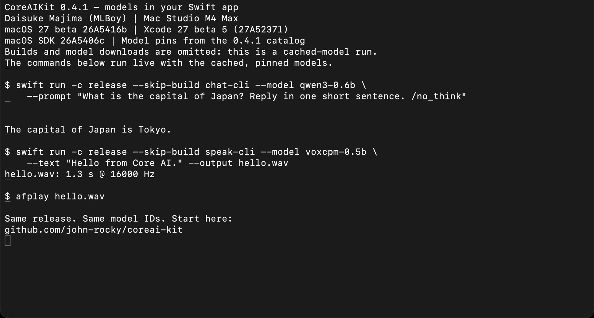

# CoreAIKit 0.4.1 — a local answer, then speech

[Watch the Mac demo](coreaikit-0.4.1-mac.mp4) · [Start with the CoreAIKit README](https://github.com/john-rocky/coreai-kit#readme)

[](coreaikit-0.4.1-mac.mp4)

A 33-second recording. Recorded by **Daisuke Majima (MLBoy)** on September 9, 2026, on a **Mac Studio M4 Max
(128 GiB)**, **macOS 27.0 beta `26A5416b`**, **Xcode 27 beta 5 `27A5237l`**,
**macOS SDK `26A5406c`**. This video establishes the Mac run; it is not an iPhone,
newer-beta, RC or GA validation record.

The recording runs the existing ChatDemo and Speak command-line examples from the
public **0.4.1** tag. Both examples resolve the public package by exact version,
without a local path dependency.

| Component | Recorded version / artifact |
|---|---|
| CoreAIKit | [`0.4.1`, `11f2823b9ba9c059b4db86c4e1682c53112006f1`](https://github.com/john-rocky/coreai-kit/releases/tag/0.4.1) |
| Core AI model runtime | `0.2.4-zoo`, `f7a75ec0f89fab451d277572afe8995b7ef768c1` |
| swift-transformers | `1.3.4`, `c21fdcde390313a6d98d8e33a346f2c3486c3ab0` |
| Qwen3 0.6B | [`943eb6a4f967de53d7e1458d75deac0b68ac3d85`](https://huggingface.co/mlboydaisuke/qwen3-0.6b-CoreAI-official/tree/943eb6a4f967de53d7e1458d75deac0b68ac3d85), `macos`, 11 files / 351,561,081 bytes |
| VoxCPM 0.5B | [`9920f9599f98ad257f09cd606240d79282db3991`](https://huggingface.co/mlboydaisuke/VoxCPM-0.5B-CoreAI/tree/9920f9599f98ad257f09cd606240d79282db3991), `macos` + `tokenizer` + `voxcpm_host_glue`, 37 files / 1,373,894,365 bytes |

Before recording, every selected cached file matched the public revision's size and
hash. Qwen was already cached; VoxCPM was first downloaded through the public Speak
CLI, then verified. Its progress restarts at zero for each of its three subtrees,
so the two progress resets in that download log represent separate component
downloads. The release starter uses the built-in Qwen pin. Speak resolves the live
catalog; its resolved revision matched the table above at capture time.

The video is a **cached-model run at normal speed**. Builds and model downloads are
omitted, as the first screen states. Editing removes the Terminal title bar and the
setup before that screen. The audio track is the WAV made by the recorded Speak
command, aligned with `afplay`; no microphone or unrelated system audio is included.
The model's displayed answer is unchanged. No benchmark is inferred from this video.

## Reproduce it

Use the tested OS and SDK above. Adjust `DEVELOPER_DIR` if the installed beta 5 app
has a different name. Build and download waits depend on your machine and network.

```bash
git clone --branch 0.4.1 --depth 1 https://github.com/john-rocky/coreai-kit.git
cd coreai-kit
export DEVELOPER_DIR=/Applications/Xcode-27.0.0-Beta.5.app/Contents/Developer
swift run -c release --package-path Examples/ChatDemo chat-cli \
  --model qwen3-0.6b \
  --prompt "What is the capital of Japan? Reply in one short sentence. /no_think"
swift run -c release --package-path Examples/Speak speak-cli \
  --model voxcpm-0.5b --text "Hello from Core AI." --output hello.wav
afplay hello.wav
```

Expect an answer mentioning Tokyo, then a 16 kHz mono WAV. The exact text can vary.
The recording uses `--skip-build` because the two public examples were already built
in Release mode. The commands above include their builds for a first-time reader.

[ChatDemo's release checks](https://github.com/john-rocky/coreai-kit/tree/0.4.1/Examples/ChatDemo#reproduce-the-release-checks)
separately cover an empty dedicated cache, FoundationModels two-turn recall and
Japanese streaming. Those are integration checks, not a guarantee of answer or
voice quality. See the [release validation record](https://github.com/john-rocky/coreai-kit/blob/main/docs/GETTING_STARTED.md#release-041-validation)
for their scope and exact environment.
